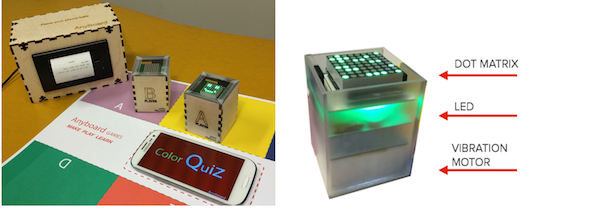
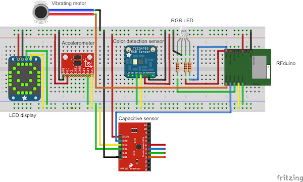

# AnyPawn

This repository contains firmware, electronic schematics and case construction files for AnyPawn

## Demo Application
See [anyPawn demo app](../games/demo-anyPawn) for a simple demonstrator of the capabilities of AnyPawn.

## Fundamentals

AnyPawns are a technology-augmented version of game tokens commonly found in most games. They are capable of capturing the set of *interaction events* triggered by the player and generating *digital feedbacks*. The following tables cluster interaction events and digital feedback supported and provide a player-perspective description of their role. Possible mapping with dynamics commonly found in board games are also exemplified. For example the action of shaking an anyPawn can be mapped to the draw of a random number or event.

Interaction events and digital feedbacks commands are exchanged between anyPawns and the smartphone running *anyboardJS library* using a 1-20 byte binary protocol over a BLE connection. Mapping between events/feedbacks names and the binary codes is provided [here](./firmware/anypawn/protocol.h).

BLE Service: 00002220-0000-1000-8000-00805f9b34fb
BLE Carachteristic for interaction events: 00002221-0000-1000-8000-00805f9b34fb
BLE Caratchteristic for feedbacks: 00002222-0000-1000-8000-00805f9b34fb

If not familliar with BLE protocol I reccomend to read [this](https://github.com/tigoe/BLEDocs/wiki/Introduction-to-Bluetooth-LE)

### Anypawn binary interface architecture

- The first byte describes the type of event or digital feedback 
- The second and third bytes add optional parameter

- Token-solo events use one byte only (name of the event)
- Token-constraint events use three bytes (name of the event, last sector ID, current sector ID
- Token-token events use two bytes (name of the event, ID of the nearby pawn, side of the pawn) *NOT IMPLEMENTED*
- Digital feedbacks use 1-20 bytes (name of the event, 1-19 bytes in payload)

### Interaction events (Events sent from the anyPawn)

| Type | Interaction Event | HEX Code (B1B2B3)  |DEC Code| Description | Sample mapping with game mechanics | Comments |
|------|----|----|-----|----|-----|-------------------------------|
| TE | SHAKE | 0xCB | 203 | anyPawn is shaken | Throw a random number |
| | TAP | 0xC9 | 201 |anyPawn is tapped on the top side | Increase a resource by one unit |
| | DOUBLE-TAP | 0xCA | 203 | anyPawn is double-tapped on the top side | Decrease a resource by one unit |
| | TILT | 0xCC | 204 |anyPawn is tilted upside down | Undo a previous action | Not implemented
| TCE | MOVE | 0xC2[current][last] | 194,[c],[l]|anyPawn is moved inside a new sector of the board | Signal player's placement and movements among different board sectors | 2nd and 3rd byte contains the ID of current and last sectors (see below)

TCEs recognition is implemented by assigning and imprinting unique colors to different sectors of a game board (representing visual constraints to token’s locations). A color-sensor located on the bottom of anyPawn samples the color temperature of the surface the device is lying on, returning an unique color-code which is used as a fingerprint for board constraints, enabling to detect when anyPawn is moved between two sectors. 

| Color name |  ID (DEC) | ID (HEX) | 
|------------|-----------|----------|
|Light Blue | 5 | 0x5 |
|Blue | 2 | 0x2 |
|Dark Blue | 7 | 0x7 |
| Purple | 14 | 0xE |
| Dark Red | 16 | 0x10 |
| Red | 18 | 0x12 |
| Light Green | 21 | 0x15 |
| Green | 24 | 0x18 |
| Dark Green | 30 | 0x1E |
| Orange | 31 | 0x1F |
| Dark Orange | 33 | 0x21 |
| Yellow | 37 | 0x25 |

Printable list of color -> [PDF](Color_template_print.pdf)
(For NTNU students: boards and templates needs to be printed with IDI laser printer)

### Digital feedbacks (Commands sent to the anyPawn)

| Type | Feedback | HEX Code (B1B2..B20) | DEC Code | Description | Sample mapping with game mechanics | Comments |
|------|----------|-------|------|----|----|----------------------------|
| Visual | LED_ON | 81[R][G][B] | 129[R][G][B] | anyPawn lights up in the color defined by [R][G][B] | Show the status of a resource | [R][G][B] are RGB value in HEX |
|  | LED_BLINK | 82[time][period] | 130[time][period] | anyPawn blinks for [time] and with [period] | Show the status of a resource | |
| | MATRIX\_[number] | CF[digit] | 207[digit] | anyPawn top side display shows the number [digit] | Shows player's action point allowance |  |
| | MATRIX\_[pattern] | CE[pattern] | 230[pattern] | anyPawn top side display show a 8x8 point matrix | [pattern] is a 8-byte pattern that encode the 64 pixel on the matrix |
|Haptic| HAPTIC | C8[time] | 200[time] | anyPawn produces an haptic feedback with [time] lenght | Signal a player to move to the next turn |

Token digital feedbacks are implemented using three different devices: an RGB LED, a 8x8 LED Matrix and a vibration motor.

## Case Construction

The appearance of anyPawn can be customized with handcrafted or 3D-printed models blending the digital feedback with a static iconic or symbolic shape.

The AnyPawn case showed in figure can be produced with 3D-printing or laser cutting techniques. Drawings are provided in the (case)[./case] directory.

## Hardware Schematics

A prototype of anyPawn can be built with the following off the shelf components. The anyPawn showed in figure is designed with custom hardware components and schematics and it's currently under testing.

* RFduino ([website](http://www.rfduino.com/), [GitHub](https://github.com/RFduino/RFduino))
* Accelerometer ADXL345 ([datasheet](http://www.analog.com/media/en/technical-documentation/data-sheets/ADXL345.pdf))
* Vibrating motor ([datasheet](https://www.sparkfun.com/datasheets/Robotics/310-101_datasheet.pdf))
* Color detection sensor TCS347254 ([datasheet](https://www.adafruit.com/datasheets/TCS34725.pdf))
* Capacitive sensor MPR121 ([datasheet](https://www.sparkfun.com/datasheets/Components/MPR121.pdf)) *NOT IMPLEMENTED*
* LED display ([datasheet](https://www.sparkfun.com/datasheets/Components/MPR121.pdf), [Adafruit product](https://www.adafruit.com/products/870))

## Firmware

### Setup
AnyPawn is based on RFDUINO hardware, which includes an Arduino core and Bluetooth LE transcriver. RFDUINO plugins need to be installed on the Arduino IDE following [this guide](https://github.com/RFduino/RFduino).

In order to use all the components listed in the hardware part, some Adafruit's and support libraries have been used. You can find these libraries in the *libraries* folder. Refer to the [manual installation section in the official Arduino library guide](https://www.arduino.cc/en/Guide/Libraries#toc5) to install the libraries on your system.

Third parties libraries used (included in the libraries folder):

- For the ADXL345 the Adafruit_ADXL345 Arduino's library is used ([Adafruit_ADXL345](https://github.com/adafruit/Adafruit_ADXL345)).
- The Adafruit_ADXL345 library is based on the Adafruit's Unified Sensor Library ([Adafruit_Sensor](https://github.com/adafruit/Adafruit_Sensor)).
- For the TCS34725 used with an autorage mechanism the Adafruit library is used ([Adafruit_TCS34725](https://github.com/adafruit/Adafruit_TCS34725/tree/master/examples/tcs34725autorange))
- For the LED display the Adafruit_GFX library is used ([Adafruit_GFX](https://github.com/adafruit/Adafruit-GFX-Library))
- And the Adafruit_lED_backpack library is also required ([Adafruit_lED_backpack](https://github.com/adafruit/Adafruit-LED-Backpack-Library))
